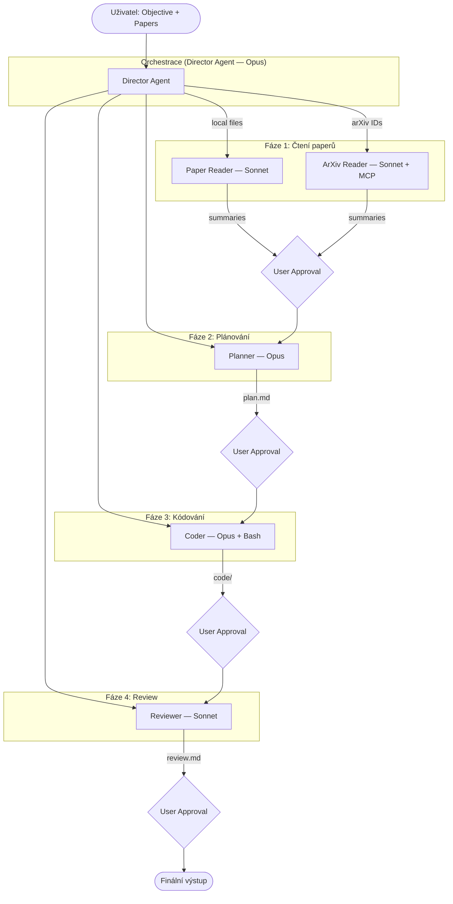
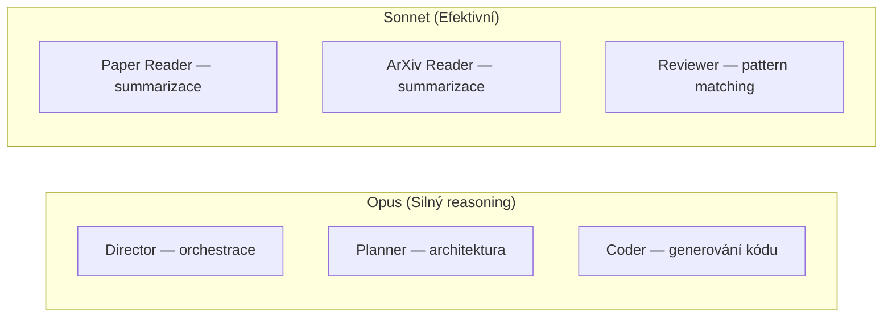

# Research Swarm — Detailní analýza projektu

> Autor analýzy: Orel 🦅 | Tým Prompt Eng | Datum: 2026-03-22

---

## Executive Summary

**Research Swarm** je plně funkční příklad produkční multi-agent AI architektury postavené na **Claude Agent SDK** (Anthropic). Projekt řeší konkrétní problém: přeměnit vědecký výzkum (PDF nebo arXiv papery) na spustitelný kód s minimální lidskou intervencí.

Systém implementuje tzv. **Director pattern** — centrální orchestrátor (Director) řídí práci specializovaných sub-agentů v sekvenčním pipeline s povinným human-in-the-loop schválením na konci každé fáze:

```
Papery → Čtení/Shrnutí → Implementační plán → Kód → Review → Doručení
```

Projekt je výjimečný tím, že:
- **Skills jsou odděleny per-agent** a jejich izolace je pokryta testy
- **Model selection je strategický** — Opus pro těžké úkoly, Sonnet pro efektivní
- **Human-in-the-loop** není afterthought, ale klíčový design prvek
- **Slash commandy** umožňují spustit libovolnou fázi pipeline izolovaně
- **MCP integrace** s Docker-based arXiv serverem pro přístup k vědeckým paperům

**Klíčová hodnota pro tým Prompt Eng**: Projekt je učebnicový příklad jak strukturovat komplexní multi-agent systém — separation of concerns, skill isolation, testovatelnost a jasná dokumentace promptů.

---

## Architektura — Přehled

### ASCII diagram (zjednodušený)

```
┌─────────────────────────────────────────────────────────────────────┐
│                        USER (CLI)                                   │
│           python main.py --objective "Build X"                      │
└─────────────────────┬───────────────────────────────────────────────┘
                      │ prompt + papers + mode
                      ▼
┌─────────────────────────────────────────────────────────────────────┐
│                   DIRECTOR AGENT  [claude-opus-4-6]                 │
│                                                                     │
│  Skills: pipeline-status, iterate-feedback                         │
│  Tools:  Read, Write, Glob, Grep, Agent, AskUserQuestion, Skill    │
│                                                                     │
│  Orchestrates pipeline in stages:                                   │
│  1 → 2 → 3 → 4 → 5, s human approval na každém přechodu            │
└──────┬──────────┬──────────────┬────────────────┬───────────────────┘
       │          │              │                │
       ▼          ▼              ▼                ▼
  [Stage 1]   [Stage 2]     [Stage 3]        [Stage 4]
┌──────────┐ ┌──────────┐ ┌──────────────┐ ┌──────────────┐
│  PAPER   │ │ PLANNER  │ │    CODER     │ │  REVIEWER    │
│  READER  │ │  [Opus]  │ │   [Opus]     │ │  [Sonnet]    │
│ [Sonnet] │ │          │ │              │ │              │
│    OR    │ │ Skills:  │ │ Skills:      │ │ Skills:      │
│  ARXIV   │ │ arch-    │ │ sandbox-     │ │ paper-       │
│  READER  │ │ design,  │ │ execute,     │ │ alignment-   │
│ [Sonnet] │ │ dep-     │ │ write-tests  │ │ check,       │
│          │ │ analysis │ │              │ │ security-    │
│ Skills:  │ │          │ │ Tools:       │ │ audit        │
│ summarize│ │ Tools:   │ │ Read, Write, │ │              │
│ -paper,  │ │ Read,    │ │ Edit, Bash,  │ │ Tools:       │
│ extract- │ │ Write,   │ │ Glob, Grep,  │ │ Read, Grep,  │
│ equations│ │ Grep,    │ │ Skill        │ │ Glob, Write, │
└──────────┘ │ Glob,    │ └──────────────┘ │ Skill        │
             │ Skill    │                  └──────────────┘
             └──────────┘
```

### Mermaid diagram (flow)



---

## Analýza každého agenta

### 1. Director Agent

| Atribut | Hodnota |
|---------|---------|
| **Soubor** | `agents/director.py` |
| **Model** | `claude-opus-4-6` (Opus — nejsilnější reasoning) |
| **Role** | Orchestrátor celého pipeline |
| **Skills** | `pipeline-status`, `iterate-feedback` |
| **Tools** | Read, Write, Glob, Grep, Agent, AskUserQuestion, Skill |

**Systémový prompt — klíčové části:**

```
You are the **Director** of a research-to-code pipeline. You orchestrate a
team of specialized sub-agents to turn research papers into working code.
```

Prompt popisuje:
- Seznam sub-agentů a jejich role
- Sekvenční workflow (Step 1 → 5) se **striktním zákazem přeskakování**
- Instrukce kdy použít konkrétní skill (`pipeline-status` při resumption, `iterate-feedback` při rework loop)
- Rules: ALWAYS get user approval, NEVER skip stages, report errors

**Jak Director spouští sub-agenty:**
Director používá tool `Agent` s parametrem `subagent_type` (jméno agenta). Každý sub-agent je definován jako `AgentDefinition` a zaregistrován v `build_agent_definitions()`. Claude Agent SDK zná dostupné sub-agenty a Director může libovolný spawnnout.

**Logování a vizualizace:**
Director má sofistikovaný colored logging v terminálu:
- Cyan = zprávy Directora
- Magenta = spawn sub-agenta
- Yellow = tool call
- Green = tool result
- Blue = task progress
- Red = errors

---

### 2. Paper Reader Agent (lokální soubory)

| Atribut | Hodnota |
|---------|---------|
| **Soubor** | `agents/arxiv_reader.py` (funkce `make_local_reader`) |
| **Model** | `sonnet` (dostačuje pro summarizaci) |
| **Role** | Čte lokální PDF/MD/TXT soubory a vytváří shrnutí |
| **Skills** | `summarize-paper`, `extract-equations` |
| **Tools** | Read, Write, Glob, Skill |

**Systémový prompt:**

```
You are a **Research Paper Analyst**. Your job is to read papers from local
files and produce concise, actionable summaries that a software engineer can
use to implement the ideas.
```

Workflow v promptu:
1. Read each file via `Read` tool (PDF support s chunks)
2. Pro každý paper → `summarize-paper` skill
3. Pro každý paper → `extract-equations` skill
4. Write `output/summaries/<name>.md` + `_equations.md`
5. Finale: `_overview.md` — ranking paperů dle relevance

**Klíčová technika** — `SUMMARY_TEMPLATE` je sdílenou konstantou pro oba reader agenty, definuje přesný formát výstupu:
```python
SUMMARY_TEMPLATE = """\
For each paper, produce a summary with these sections:
   **Title**: <paper title>
   **Core Idea**: 1-2 sentence distillation...
   **Implementation-Critical Details**: Hyper-parameters, loss functions...
   **Equations / Pseudocode**: Copy the most important equations verbatim.
   ...
"""
```

---

### 3. ArXiv Reader Agent (online stahování)

| Atribut | Hodnota |
|---------|---------|
| **Soubor** | `agents/arxiv_reader.py` (funkce `make_arxiv_reader`) |
| **Model** | `sonnet` |
| **Role** | Stahuje papery z arXiv přes MCP server |
| **Skills** | `summarize-paper`, `extract-equations` (identické s Paper Reader) |
| **Tools** | `mcp__arxiv-mcp-server__read_paper`, `mcp__arxiv-mcp-server__download_paper`, `mcp__arxiv-mcp-server__search_papers`, Read, Write, Glob, Skill |

Používá **Docker-based MCP server** (`mcp/arxiv-mcp-server`) komunikující přes stdin/stdout (JSON-RPC).

MCP config v `config.py`:
```python
ARXIV_MCP_CONFIG = {
    "command": "docker",
    "args": ["run", "-i", "--rm", "-e", "ARXIV_STORAGE_PATH",
             "-v", f"{ARXIV_STORAGE_PATH}:{ARXIV_STORAGE_PATH}",
             "mcp/arxiv-mcp-server"],
}
```

MCP server je připojen **pouze v arxiv mode** — v local mode se vůbec nespouští:
```python
mcp_servers = {}
if mode == "arxiv":
    mcp_servers["arxiv-mcp-server"] = ARXIV_MCP_CONFIG
```

---

### 4. Planner Agent

| Atribut | Hodnota |
|---------|---------|
| **Soubor** | `agents/planner.py` |
| **Model** | `opus` (architektonické rozhodnutí vyžaduje silný reasoning) |
| **Role** | Vytváří detailní implementační plán ze shrnutí paperů |
| **Skills** | `architecture-design`, `dependency-analysis` |
| **Tools** | Read, Write, Grep, Glob, Skill |

**Systémový prompt:**
```
You are an **Implementation Architect**. You translate research paper summaries
into concrete, step-by-step engineering plans that a code-writing agent can
follow to build a working system.
```

Deliverable je `output/plans/plan.md` s 8 pevnými sekcemi:
1. Objective Restatement
2. Architecture Overview (via `architecture-design` skill)
3. Dependencies (via `dependency-analysis` skill → `dependencies.md`)
4. Step-by-Step Plan (co, proč, soubory, acceptance criteria, code skeleton)
5. Data & Preprocessing
6. Testing Strategy
7. Integration with Existing Agents
8. Risks & Open Questions

**Důležité**: Každý krok v plánu musí mít **Acceptance Criteria** — co přesně ověří, že je krok hotový. To je klíčová inženýrská praxe.

---

### 5. Coder Agent

| Atribut | Hodnota |
|---------|---------|
| **Soubor** | `agents/coder.py` |
| **Model** | `opus` (komplexní generování kódu) |
| **Role** | Píše produkční Python kód z plánu, testuje v sandbox |
| **Skills** | `sandbox-execute`, `write-tests` |
| **Tools** | Read, Write, Edit, **Bash**, Glob, Grep, Skill |

**Systémový prompt:**
```
You are an **Implementation Engineer**. You receive a detailed implementation
plan and write production-quality Python code that faithfully implements the
techniques described in the referenced research papers.
```

Workflow je přísně sekvenční:
1. Přečti plán
2. Instaluj dependencies
3. Pro každý krok v plánu: piš kód → `sandbox-execute` → fix → ověř → next
4. Vytvoř `main.py`, `requirements.txt`, `USAGE.md`
5. `write-tests` skill pro generování pytest suite

**Klíčová vlastnost**: Coder má přístup k `Bash` toolu — to mu umožňuje fakticky spouštět kód. Ostatní agenti (Reviewer, Planner) Bash nemají záměrně.

**Code Standards v promptu** — explicitní požadavky:
- Type hints throughout
- Funkce < 50 řádků
- Docstrings pro public functions
- CPU fallback pro GPU kód

---

### 6. Reviewer Agent

| Atribut | Hodnota |
|---------|---------|
| **Soubor** | `agents/reviewer.py` |
| **Model** | `sonnet` (pattern-matching review nepotřebuje Opus) |
| **Role** | Review kódu vůči paperům, bezpečnostní audit |
| **Skills** | `paper-alignment-check`, `security-audit` |
| **Tools** | Read, Grep, Glob, Write, Skill (bez Edit a Bash!) |

**Systémový prompt:**
```
You are a **Code Review Specialist** with deep expertise in ML/AI
implementations. You review code that was generated from research paper
implementations.
```

Review proces je 4-krokový:
1. `paper-alignment-check` skill → alignment.md
2. `security-audit` skill → security.md
3. Code Quality review (readability, funkce velikost, duplicity)
4. Completeness check (pokrytí plánu, main.py, requirements.txt)

Výstup je `review.md` s **celkovým hodnocením: PASS / NEEDS_CHANGES / FAIL**.

**Důležité**: Reviewer nemá `Edit` ani `Bash` — záměrný design. Reviewer pouze čte a píše review reporty, nikdy nemodifikuje kód. Separation of concerns.

---

## Analýza Skills systému

### Struktura SKILL.md

Každý skill je soubor `SKILL.md` v adresáři `.claude/skills/<skill-name>/`. Struktura:

```markdown
---
description: Jedna věta popisující KDY agent skill použije.
Klíčová slova, která matchují kontext tasku.
---

# Název Skillu

Instrukce pro agenta. Obsahuje:
- Co má agent dělat
- Přesný output formát
- Pravidla a omezení
- Příklady kódu / template
```

### YAML Frontmatter

Klíčový element je `description` field — **to je mechanismus triggering**. Claude SDK čte description a agent sám rozhodne, zda skill aplikovat na základě kontextu aktuálního tasku.

Příklady description fieldů:
```yaml
# summarize-paper
description: Produce a structured, implementation-focused summary of a research paper.
Use this when reading any paper (PDF, markdown, or arXiv) to ensure consistent,
actionable summaries.

# sandbox-execute
description: Execute code in an isolated sandbox to verify correctness.
Use this whenever you write or modify code to ensure it runs without errors
before moving on.
```

**Pravidlo dobrého description**: Obsahuje klíčová slova, která se přirozeně objeví v tasku kde skill má smysl použít. Je to de facto trigger condition.

### Přehled všech skills

| Skill | Agent | Účel |
|-------|-------|------|
| `pipeline-status` | Director | Zkontroluje stav output adresářů, zjistí co je hotovo |
| `iterate-feedback` | Director | Orchestruje rework loop po NEEDS_CHANGES review |
| `summarize-paper` | Paper/ArXiv Reader | Strukturované shrnutí paperu pro inženýry |
| `extract-equations` | Paper/ArXiv Reader | Extrakce LaTeX rovnic do samostatného souboru |
| `architecture-design` | Planner | ASCII/Markdown diagram architektury, datový flow |
| `dependency-analysis` | Planner | Výběr knihoven s verzemi, generuje `dependencies.md` |
| `sandbox-execute` | Coder | Spuštění kódu, ověření výstupů, max 3 retry |
| `write-tests` | Coder | Generování pytest suite (shapes, gradients, determinism) |
| `paper-alignment-check` | Reviewer | Checklist: algoritmus, rovnice, hyperparametry, architektura |
| `security-audit` | Reviewer | OWASP-style audit: secrets, injection, serialization |

### Skill Isolation — testovaná vlastnost

Projekt má explicitní test suite (`tests/test_agent_skills.py`) ověřující:
1. Každý agent má přesně přiřazené skills (žádné navíc, žádné chybějící)
2. Žádný skill neunikl mimo správný agent
3. Každý agent se skills má `Skill` tool v tool listu
4. Každý skill má `SKILL.md` na disku
5. Žádné orphan skill soubory
6. Všechny SKILL.md mají description v frontmatter
7. Oba readery sdílejí identické skills
8. Coder nemá reviewer skills
9. Reviewer nemá execution skills
10. Planner nemá execution skills

Toto je **unikátní a velmi užitečná praxe** — skills jako testovaný kontrakt.

---

## Analýza Prompt Engineeringu

### Techniky použité v projektech

#### 1. Role + Expertise framing
Každý agent začíná přiřazením identity:
```
You are a **Research Paper Analyst**.
You are an **Implementation Architect**.
You are a **Code Review Specialist** with deep expertise in ML/AI implementations.
```
Technika: Bold pro roli, specifický domain expertise v popisu.

#### 2. Explicit Workflow (numbered steps)
Prompty neříkají "udělej X" — říkají přesně co, kdy a v jakém pořadí:
```
## Workflow
1. You will receive a list of file paths and an objective from the user.
2. For each file path, use the `Read` tool to read the file contents.
3. [SUMMARY_TEMPLATE]
4. After processing all papers, write each summary to output/summaries/<paper_filename>.md
5. Finally, write a consolidated output/summaries/_overview.md ranking papers by relevance.
```

#### 3. Output Template Contracts
Místo vágního "write a summary" jsou definovány přesné sekce s příklady:
```
### Header
```markdown
# <Paper Title>
**Source**: <file path or arXiv ID>
**Date Read**: <today's date>
**Relevance**: <HIGH / MEDIUM / LOW> to the stated objective
```
```
Výsledek: konzistentní, parsovatelné výstupy.

#### 4. Tool-Skill Mapping v promptu
Agenti jsou explicitně instruováni KDY použít jaký skill:
```
You have two skills available:
- **sandbox-execute**: Use this to run code in an isolated sandbox after
  writing each module. Every file MUST be executed and verified.
- **write-tests**: Use this after implementing all modules...
```

#### 5. Constraints as Rules sekce
Na konci každého promptu je sekce `## Rules` nebo `## Guidelines`:
```
## Rules
- ALWAYS use AskUserQuestion or direct questions to get user approval between stages.
- NEVER skip a stage or proceed without user confirmation.
- If a sub-agent fails, report the error and ask the user how to proceed.
```
Capitals (ALWAYS, NEVER) pro hard constraints.

#### 6. Shared template jako Python konstanta
`SUMMARY_TEMPLATE` je definována jednou v `arxiv_reader.py` a použita v obou reader promptech:
```python
SUMMARY_TEMPLATE = """\
For each paper, produce a summary with these sections:
...
"""
LOCAL_READER_PROMPT = f"... {SUMMARY_TEMPLATE} ..."
ARXIV_READER_PROMPT = f"... {SUMMARY_TEMPLATE} ..."
```
Výsledek: single source of truth pro formát výstupu, bez duplikace.

#### 7. Progressive Complexity
Pořadí sekcí v promptech odpovídá kognitivní náročnosti:
1. Role (kdo jsi)
2. Skills (jaké nástroje máš)
3. Inputs (co dostaneš)
4. Workflow (co přesně děláš, krok za krokem)
5. Rules (co nikdy nesmíš)

#### 8. Acceptance Criteria v plánovacích promptech
Planner je instruován přidat k **každému kroku** acceptance criteria:
```
Each step must have:
- **What**: A clear description of what to build.
- **Why**: Which paper/technique motivates this step.
- **Acceptance Criteria**: How to verify the step is done correctly.
```

#### 9. Severity grading v review promptu
Reviewer má přesně definované severity levels:
```
File-by-File Review: For each file, list issues with severity
(critical / major / minor / nit).
```
A pro security:
- CRITICAL = Exploitable vulnerability
- HIGH = Unsafe practice
- MEDIUM = Best practice violation
- LOW = Code quality issue

#### 10. Iterace s omezeným počtem retries
`sandbox-execute` skill má explicitní omezení:
```
Fix the code, Re-run (max 3 retries per file)
```
`iterate-feedback` skill:
```
Maximum 3 rework cycles before escalating to the user.
```
Prevence nekonečných smyček.

---

## Orchestrace — Director Pattern a Agent Handoff

### Jak orchestrace funguje

Director je spuštěn pomocí `claude_agent_sdk.query()` s `AsyncIterable` prompt streamem. SDK udržuje session otevřenou přes `asyncio.Queue`:

```python
user_queue: asyncio.Queue[dict | None] = asyncio.Queue()
await user_queue.put(initial_prompt)

async def prompt_stream():
    while True:
        msg = await user_queue.get()
        if msg is None:
            break
        yield msg

async for message in query(prompt=prompt_stream(), options=options):
    _log_message(message)
```

Tato architektura umožňuje **bidirectionální komunikaci** — Director může klást otázky uživateli (přes `AskUserQuestion` tool) a uživatel odpovídá přes `can_use_tool` callback.

### Agent Handoff

Sub-agenti nejsou spouštěni jako separátní procesy — jsou definováni jako `AgentDefinition` objekty a předány Directoru přes `options.agents`. Director pak spouští sub-agenty pomocí `Agent` tool:

```python
# V options
options = ClaudeAgentOptions(
    agents=build_agent_definitions(),  # dict[str, AgentDefinition]
    ...
)

# Director zavolá:
# Agent(subagent_type="planner", prompt="Create implementation plan...")
```

SDK abstrahuje spouštění sub-agentů — Director neví o implementačních detailech, pouze volá tool.

### Výsledky jsou předávány přes soubory

Agent handoff neprobíhá přes přímé předávání objektů — výsledky jsou **zapisovány do sdíleného output adresáře** a každý následující agent čte výstupy předchozího:

```
Paper Reader → output/summaries/*.md
Planner      → output/plans/plan.md, dependencies.md  
Coder        → output/code/*.py
Reviewer     → output/reviews/review.md
```

Tato "file-based handoff" technika má výhody:
- Jednoduché, debugovatelné
- Výstupy jsou persistované mezi spuštěními
- Každý agent je nezávisle testovatelný

### Rework Loop (iterate-feedback skill)

Když reviewer vrátí `NEEDS_CHANGES`, Director použije `iterate-feedback` skill:
```
1. Read output/reviews/review.md
2. Extract critical + major issues
3. Compose focused prompt pro Coder s konkrétními issues
4. Dispatch Coder s tímto promptem
5. Dispatch Reviewer znovu
6. Report updated status
Max 3 cykly, pak eskaluj uživateli.
```

---

## Slash Commandy

### Struktura slash commandu

Každý slash command je `.md` soubor v `.claude/commands/` s YAML frontmatter:

```markdown
---
allowed-tools: Read, Write, Edit, Bash, Glob, Grep
description: Implement code from the approved plan
model: claude-opus-4-6
argument-hint: [optional modifications]
---

You are the **Implementation Engineer**. Write working code...

User notes: $ARGUMENTS
```

**YAML frontmatter klíče:**
- `allowed-tools` — whitelist nástrojů pro tuto session
- `description` — zobrazí se v Claude Code UI
- `model` — override modelu pro daný command
- `argument-hint` — hint pro uživatele (co napsat za command)

**`$ARGUMENTS`** — placeholder pro text který uživatel napíše za slash command:
```
/implement optimize transformer blocks
# $ARGUMENTS = "optimize transformer blocks"
```

### Přehled slash commandů

| Command | Model | Účel | Tools |
|---------|-------|------|-------|
| `/research <objective>` | Opus | Celý pipeline (read→plan→code→review) | Read, Write, Glob, Grep, Agent, AskUserQuestion, Bash |
| `/read-papers [args]` | Sonnet | Pouze čtení paperů | Read, Write, Glob, Grep, Agent, MCP tools |
| `/plan <objective>` | Opus | Pouze plánování | Read, Write, Grep, Glob |
| `/implement [notes]` | Opus | Pouze kódování | Read, Write, Edit, Bash, Glob, Grep |
| `/review [focus]` | Sonnet | Pouze review | Read, Grep, Glob, Write |

### Rozdíl slash command vs AgentDefinition

Slash commandy jsou pro **přímé použití v Claude Code** (IDE integrace). AgentDefinition jsou pro **programatické spouštění z Pythonu**. Oba definují stejné agenty, ale přes jiné rozhraní:

| | Slash Command | AgentDefinition |
|-|---|---|
| Použití | V Claude Code UI: `/implement` | Python: `make_coder()` |
| Konfigurace | YAML frontmatter | Python objekt |
| Kontext | Stateless (každé spuštění) | Managed SDK session |
| Human approval | Řeší Claude Code UI | `can_use_tool` callback |

---

## Human-in-the-Loop Implementation

### `can_use_tool` callback

Srdce HITL mechanismu je `can_use_tool` async callback v `director.py`. Volaný SDK před každým tool call:

```python
async def can_use_tool(tool_name: str, input_data: dict, context) -> object:
    # Auto-approve read-only tools
    if tool_name in {"Read", "Glob", "Grep", "WebSearch", "WebFetch"}:
        return PermissionResultAllow(updated_input=input_data)
    
    # Auto-approve writes to output/
    if tool_name in ("Write", "Edit"):
        if "/output/" in input_data.get("file_path", ""):
            return PermissionResultAllow(updated_input=input_data)
    
    # Auto-approve arXiv MCP tools
    if tool_name.startswith("mcp__arxiv"):
        return PermissionResultAllow(updated_input=input_data)
    
    # AskUserQuestion — intercept a zobraz uživateli
    if tool_name == "AskUserQuestion":
        # ... zobraz otázku, collect answer, return v input_data
        return PermissionResultAllow(updated_input=updated)
    
    # Agent spawning — auto-approve
    if tool_name == "Agent":
        return PermissionResultAllow(updated_input=input_data)
    
    # Bash commands — VŽDY otoč na uživatele
    if tool_name == "Bash":
        cmd = input_data.get("command", "")
        response = input("  Allow? (y/n): ").strip().lower()
        if response == "y":
            return PermissionResultAllow(updated_input=input_data)
        return PermissionResultDeny(message="User denied this command.")
    
    # Default: allow
    return PermissionResultAllow(updated_input=input_data)
```

### Matice auto-approve vs prompt

| Tool | Behavior | Důvod |
|------|----------|-------|
| Read, Glob, Grep | Auto-approve | Read-only, bezpečné |
| Write → output/ | Auto-approve | Zapsání výsledků je očekávané |
| Write → mimo output/ | Prompt | Neočekávaná operace |
| ArXiv MCP tools | Auto-approve | Kontrolované stahování |
| Agent spawn | Auto-approve | Director potřebuje spouštět sub-agenty |
| AskUserQuestion | Intercept + display | Klíčový schvalovací bod pipeline |
| Bash | Vždy prompt | Potenciálně nebezpečné příkazy |

### AskUserQuestion — interaktivní schválení

Projektuje přirozený dialog: Director volá `AskUserQuestion` (standardní Claude tool) s textem otázky a optionálně s výběrem možností. Callback zobrazí otázku uživateli a vrátí odpověď jako `updated_input` — agent dostane odpověď jako výsledek tool callu.

```
============================================================
  Director:
  Here's what I found in the papers:
  - Paper 1: Novel attention mechanism...
  - Paper 2: Transformer optimization...
  
  Which papers/techniques should we proceed with?
============================================================
  Your answer: Focus on Paper 1, skip Paper 2
```

---

## Model Strategy — proč jaký model kde



| Agent | Model | Odůvodnění |
|-------|-------|------------|
| Director | `claude-opus-4-6` | Komplexní orchestrace, multi-step reasoning, rozhodování o workflow |
| Planner | `opus` | Architektonická rozhodnutí vyžadují deep reasoning, generuje plán pro celý systém |
| Coder | `opus` | Generování správného kódu z matematických paperů je náročné |
| Paper Reader | `sonnet` | Summarizace je dobře definovaný task, Sonnet je dostačující a levnější |
| ArXiv Reader | `sonnet` | Stejný reasoning jako Paper Reader |
| Reviewer | `sonnet` | Review je v podstatě pattern matching checklist — nepotřebuje Opus |

**Ekonomická logika**: Tři "těžké" agenty (Director, Planner, Coder) používají Opus. Tři "lehčí" (Readery + Reviewer) používají Sonnet. Výsledkem je optimální cost/quality poměr.

---

## Klíčové lekce a Best Practices

### 1. Director Pattern jako orchestrační základ
Jeden centrální agent, který **neimplementuje business logiku** — pouze orchestruje. Sub-agenti jsou nezávislé jednotky se svými tools, skills, modely. Director jen rozhoduje *kdo* a *kdy*.

**Lesson**: Oddělte orchestraci od implementace. Director neví jak číst PDF nebo psát kód — deleguje.

### 2. Skill isolation je testovatelná vlastnost
Skills nejsou jen "dokumentace" — jsou to kontrakty ověřené testy. Test suite explicitně ověřuje že Coder nemá Reviewer skills a naopak.

**Lesson**: Skills = kontrakty. Pište testy na skill assignment stejně jako na funkce.

### 3. File-based agent handoff
Agenti si nepředávají data přes paměť nebo return values — píší do sdíleného adresáře (`output/`). Každý agent čte výstupy předchozího.

**Lesson**: File-based handoff je jednoduchý, debugovatelný a umožňuje restart od libovolné fáze.

### 4. Output template contracts
Přesný formát výstupu (sekce, názvy souborů, struktura) je definován v promptu jako kontrakt. Výsledky jsou pak jednoduše parsovatelné dalším agentem.

**Lesson**: Vždy definujte přesný output format — název souboru, sekce, datový typ.

### 5. Rules sekce s CAPS pro hard constraints
Každý prompt končí `## Rules` nebo `## Guidelines` s explicitními omezeními psanými CAPS:
```
- NEVER skip a stage
- ALWAYS get user approval
- Every file MUST be executed and verified
```

**Lesson**: Soft guidelines nestačí. Hard constraints pište CAPS a oddělte je do `## Rules` sekce.

### 6. Model per task difficulty
Nepřiřazujte vždy nejsilnější model — mapujte model na obtížnost tasku. Summarizace → Sonnet. Komplexní reasoning → Opus.

**Lesson**: Cost optimization je architektonické rozhodnutí, ne afterthought.

### 7. Retry + escalation limit
Každý cyklický task má explicitní max retry:
- Sandbox execute: max 3 retries per file
- Rework loop: max 3 cycles

**Lesson**: Vždy přidejte exit condition na smyčky, jinak agent loopuje donekonečna.

### 8. SUMMARY_TEMPLATE jako shared constant
Sdílená Python konstanta pro prompt template zajišťuje konzistenci mezi agenty bez duplikace:
```python
SUMMARY_TEMPLATE = "..."
LOCAL_READER_PROMPT = f"...{SUMMARY_TEMPLATE}..."
ARXIV_READER_PROMPT = f"...{SUMMARY_TEMPLATE}..."
```

**Lesson**: DRY platí i pro prompty. Sdílené části extrahujte jako konstanty.

### 9. can_use_tool callback = jemná kontrola
Granulární kontrola co je auto-approved vs co vyžaduje interakci. Neblokujte vše (frustruje uživatele), ale chraňte nebezpečné operace (Bash).

**Lesson**: Designujte human-in-the-loop granularně — auto-approve bezpečné operace, prompt pro nebezpečné.

### 10. Slash commandy = entry points per fáze
Každá fáze pipeline má vlastní slash command (`/read-papers`, `/plan`, `/implement`, `/review`). Uživatel může spustit libovolnou fázi izolovaně.

**Lesson**: Navrhujte pipeline tak, aby každá fáze byla spustitelná samostatně.

---

## Doporučení pro tým Prompt Eng

### Okamžitě aplikovatelné (copy-paste)

**A. SKILL.md struktura**
Přijmout stejnou strukturu pro naše skills:
```markdown
---
description: Specifický popis KDY skill použít. S keywords.
---

# Název Skillu

## Workflow
1. Krok 1
2. Krok 2

## Output Format
...přesný template...

## Rules
- VŽDY ...
- NIKDY ...
```

**B. Test suite pro skill assignment**
Napsat analogický test jako `test_agent_skills.py`:
```python
EXPECTED_SKILLS = {
    "agent-1": ["skill-a", "skill-b"],
    "agent-2": ["skill-c"],
}

def test_no_skill_leakage():
    # Ověř že agent-2 nemá skill-a nebo skill-b
```

**C. Rules sekce v každém systémovém promptu**
Přidat `## Rules` sekci s CAPS constraints na konec každého systémového promptu.

**D. Output template contracts**
Definovat přesný výstupní formát (sekce, soubory, naming) v promptu jako template.

### Střednědobě implementovatelné

**E. Director Pattern pro složitější workflows**
Pokud máme víc než 2-3 agenty, zvážit centrální Director který orchestruje místo přímého řetězení.

**F. File-based handoff**
Standardizovat předávání výsledků mezi agenty přes sdílený adresář (ne přes memory/return values).

**G. Model tier strategy**
Explicitně definovat kdy použít jaký model:
- Orchestrace, reasoning → Opus
- Summarizace, pattern matching → Sonnet
- Jednoduché tasky → Haiku

**H. Retry + escalation limits**
Přidat do každého cyklického tasku max iteration count a eskalaci na uživatele.

### Inspirativní koncepty (delší horizont)

**I. HITL jako callback**
`can_use_tool` callback pattern je elegantní — centralizuje všechna rozhodnutí o povolení v jedné funkci. Zvážit adoptovat pro naše Claude Code sessions.

**J. Slash commandy jako fázové entry points**
Každá větší fáze workflow by měla mít slash command, aby ji šlo spustit izolovaně pro debugging nebo parciální re-run.

**K. MCP integrace pro specializované tools**
arXiv MCP je příklad jak přidat specializované read-only tools přes Docker bez modifikace codebase. Potenciál pro interní tools (databáze, API, apod.).

---

## Závěr

Research Swarm je **referenční implementace** multi-agent systému. Silné stránky:

1. **Čistá architektura** — Director pattern je jasný a rozšiřitelný
2. **Testovaná izolace** — skills jsou kontrakty, ne jen dokumentace  
3. **Pragmatický HITL** — schválení tam kde má smysl, auto-approve kde ne
4. **Model ekonomika** — Opus pro těžké, Sonnet pro lehké tasky
5. **Rozšiřitelnost** — přidat agenta = 1 Python file + SKILL.md soubory + test update

Pro tým Prompt Eng je největší hodnotou ne samotný kód, ale **architektonické vzory a prompt engineering techniky** které lze přímo aplikovat na náš vlastní multi-agent ekosystém kolem Solomona/Orla.

---

*Report zpracován: 2026-03-22 | Zdroj: https://github.com/Cenrax/researchswarm*
